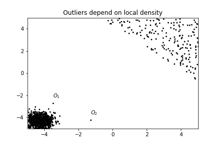

Title: Understanding the Local Outlier Factor (LOF) Algorithm
Date: 2020-11-20
Category: computer science

This article tries to explain the well-known LOF-algorithm. We provide
intuition for density-based outlier detection, show the problems
inherent to this task and then take a look at how LOF solves these
problems.

# Motivation

Outlier detection is important for many real world applications -
typical examples include fraud detection, network intrusion detection
or the detection of faulty sensor data. Although there is no "real"
definition of what constitutes an outlier, the well-established
definition is due to [^Hawkins(1980)]:

> [...] an observation that deviates so much from other observations
> as to arouse suspicion that it was generated by a different
> mechanism.

How does one go about finding these observations? The literature
distinguishes different models to detect outliers [^Aggarwal(2017)]:
extreme values, clustering models, distance-based models,
density-based models, probabilistic models, and information theoretic
models. For our purposes, distance-based and density-based models are
the most relevant. Note that both are closely linked.

# Intuition

The original paper [^Breunig et al.(2000)] introduced LOF as a
density-based model. Going with the disambiguation from
[^Aggarwal(2017)], this means that "the local density of a data point
is used to define its outlier score". Let's visualize this:

Looking at the figure, we expect $O_1$ and $O_2$ to have the highest
outlier score - even though $O_1$ has the same distance from the
cluster in the bottom left as all the points have to each other in the
cluster on the top right.

The idea of LOF is to look at the neighborhood of each point
individually and to compute its "outlierness" based on its
neighbors. So, in a sense, one estimates the density of the data
distribution at each observed point and uses this to determine whether
the point is an outlier.

# Formal Definition

Let's get to the definitions of the paper and see how they map to our
intuition of density-based outlier detection. All of the following
definitions are repeated in their original form from [^Breunig et al.(2000)]. 
Note that $D$ refers to the full data set.

__k-distance of an object p:__ For any positive integer $k$, the
$k$-distance of object $p$, denoted as _k-distance(p)_ is defined as
the distance $d(p,o)$ between $p$ and an object $o \in D$ such that:

1. for at least $k$ objects $o' \in D \setminus \{p\}$ it holds that
   $d(p,o') \leq d(p,o)$, and
2. for at most $k-1$ objects $o' \in D\setminus \{p\}$ it holds that
   $d(p,o') < d(p,o)$.

Put differently, the _k-distance_ of an object is the distance to the k-th nearest object. Or, starting from an object $o$, we compute the distance to all objects $o' \in D$, sort them in increasing order and take the k-th element of this list.

__k-distance neighborhood of an object p:__ Given the k-distance of $p$, the _k-distance neighborhood of p_ contains every object whose distance from $p$ is not greater than the k-distance, i.e., $N_{k-distance(p)}(p) = \left\{q \in D\setminus\{p\} : d(p,q) \leq k-distance(p) \right\}$.

Let's illustrate this with an example. Suppose we have five data point
in our data set $D=\{o_1,\dots,o_5\}$ and we are interested in the
3-distance of $o_1$ as well as its neighborhood. We compute
$d(o_1,o_n)$ for all $n =2,\dots, 5$ and order the results. Assume
these are the distances:

$$d(o_1,o_2) = 0.2$$
$$d(o_1,o_3) = 4.0$$
$$d(o_1,o_4) = 0.5$$
$$d(o_1,o_5) = 0.5 $$

Then our _3-distance_ is 0.5 and there are three objects in the neighborhood.

In Euclidian space, think of this as putting a circle with its center
at $o_1$ and increasing the radius until k elements are in it. As
distances can be equal there might be more than k elements in the
circle.

__reachability distance of an object p w.r.t. object o:__ Let $k$ be a
natural number. The reachability distance of object $p$ w.r.t. $o$ is
defined as

$$reach-dist_k(p,o) = max \{ k-distance(o),d(p,o)\} $$

This is used to smooth the density estimation: For objects far away
from each other, their distance is the actual distance. For objects
close to each other, their distance is their k-distance.

Please note that the reach-distance is not a proper distance measure as is not symmetric.

__local reachability density of an object p:__ The _local reachability
density of p_ is defined as

$$lrd_{MinPts}(p) = \frac{|N_{MinPts}(p)|} {\sum_{o \in N_{MinPts}(p)} reach-dist_{MinPts}(p,o)}.$$

In general, a density is mass per volume, i.e., this definition implicitly assumes each element in the neighborhood of p to have unit mass. "The volume" is given by the sum of all reachability-distances of the element in the neighborhood of a point.

With these preliminaries done, we can finally define the local outlier factor:

__(local) outlier factor of an object p:__ The _local outlier factor_ of p is defined as

$$LOF_{MinPts}(p) = \frac{\sum_{o\in N_{MinPts}(p)}\frac{lrd_{MinPts}(o)}{lrd_{MinPts}(p)}}{|N_{MinPts}(p)|}.
$$

We can actually simplify this formula slightly,

$
\begin{aligned}
\frac{\sum_{o\in N_{MinPts}(p)}\frac{lrd_{MinPts}(o)}{lrd_{MinPts}(p)}}{|N_{MinPts}(p)|} &= \frac{\sum_{o\in N_{MinPts}(p)}lrd_{MinPts}(o)}{lrd_{MinPts}(p)|N_{MinPts}(p)|}\\
&= \frac{\sum_{o\in N_{MinPts}(p)}lrd_{MinPts}(o)}{\frac{|N_{MinPts}(p)|} {\sum_{o \in N_{MinPts}(p)} reach-dist_{MinPts}(p,o)}|N_{MinPts}(p)|}\\
&= \sum_{o\in N_{MinPts}(p)}lrd_{MinPts}(o)\sum_{o \in N_{MinPts}(p)} reach-dist_{MinPts}(p,o),
\end{aligned}
$

so the local outlier factor of a point is given by the density of its
neighboring points, times the sum of the reach-distance to these
points.

Based on this last formula, we see that a point has a large local
outlier factor if its neighbors are in dense areas (then the first sum
becomes large) _and_ if these points are far away, i.e., the point has
no direct neighbors. It turns out that this notion captures the
locality aspect of outlier detection surprisingly well.

# References

[^Hawkins(1980)]: D Hawkins. Identification of Outliers. Springer Netherlands, 1980.
[^Aggarwal(2017)]: C C Aggarwal. Outlier Analysis. Springer International Publishing, 2nd ed., 2017.
[^Breunig et al.(2000)]: M M Breunig et al. LOF: identifying density-based local outliers. Proceedings of the 2000 ACM SIGMOD international conference on Management of data (New York, NY, USA, May.-2000), 93–104.
