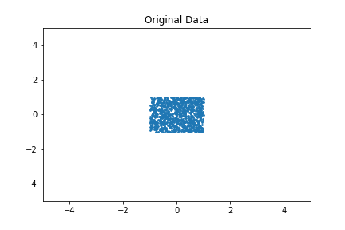
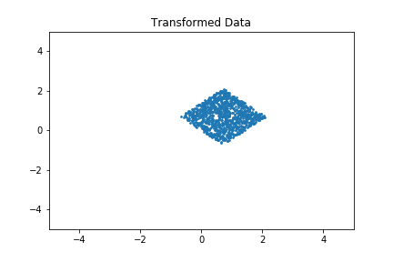

Title: Affine transformations in python
Date: 2020-11-24
Category: computer science
Tags: python, pandas

Here is just a short note on how to do an [affine
transformation](https://en.wikipedia.org/wiki/Affine_transformation)
in python succinctly.

# Code

    import numpy as np
    import matplotlib.pyplot as plt
    data = np.ones((1000,3)) # needed for the transformation
    data[:,0:2] = np.random.uniform(low=-1,high=1,size=(len(data),2)) # create some data

    deg = np.pi/4 # 90°
    rot = np.array([
    [np.cos(deg),-np.sin(deg),0],
    [np.sin(deg), np.cos(deg),0],
    [0          ,0           ,1]])
    trans = np.array([
    [1,0,1],
    [0,1,0],
    [0,0,1]])

    # this is where the magic happens
    data = data.dot((rot@trans).T)[:,:2]

So, doing an affine transformation with a dataset is, given the transformation matrix, actually a one-line in Python with numpy.

# Result

Before the transformation:

After the transformation:

