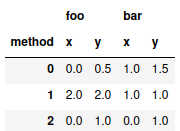

Title: Highlighting Pandas .to_latex() Output in Bold Face for Extreme Values
Date: 2021-01-07
Category: computer science

When preparing a table with experimental results for publication one
often wishes to highlight the output of extreme cells, for example by
putting them in bold.

However, pandas does not readily support this use case. The closest
one gets with stock pandas is `table.style.highlight_max(axis=1)`
which highlights the maximum values in yellow. Note that this does not
work properly with multi-indexed columns: Here only one extreme value
per row will be highlighted.

So, what one wishes is to automatically output a pandas dataframe as
latex while highlighting certain column-sets using their maximum and
others by using their minimum. Let's do that!

# Code

We start by creating a small test dataframe:

```python
import pandas as pd

test = pd.DataFrame({"foo" : [0,2,0,0.5,2,1], 
	"bar":[1,1,0,1.5,1,1], 
	"method": ["x","x","x","y","y","y"]},
	index=[0,1,2,0,1,2]).pivot(columns="method")
test
```



Now, define the function which does the magic:

```python
def bold_extreme_values(data, format_string="%.2f", max_=True):
	if max_:
		extrema = data != data.max()
	else:
		extrema = data != data.min()
	bolded = data.apply(lambda x : "\\textbf{%s}" % format_string % x)
	formatted = data.apply(lambda x : format_string % x)
	return formatted.where(extrema, bolded) 
```

Additionally, we have to tell python which columns we would like to
highlight by the maximum and for which to use the minimum:

```python
col_show_max = { "foo": True, "bar" : False}
```

Now we run our method on the dataframe and output the result:

```python
for col in test.columns.get_level_values(0).unique():
    test[col] = test[col].apply(lambda data : bold_extreme_values(data, max_=col_show_max[col]),axis=1)
print(test.to_latex(escape=False))
```

```text
\begin{tabular}{lllll}
\toprule
{} & \multicolumn{2}{l}{foo} & \multicolumn{2}{l}{bar} \\
method &              x &              y &              x &              y \\
\midrule
0 &           0.00 &  \textbf{0.50} &  \textbf{1.00} &           1.50 \\
1 &  \textbf{2.00} &  \textbf{2.00} &  \textbf{1.00} &  \textbf{1.00} \\
2 &           0.00 &  \textbf{1.00} &  \textbf{0.00} &           1.00 \\
\bottomrule
\end{tabular}
```

And that's it :)

